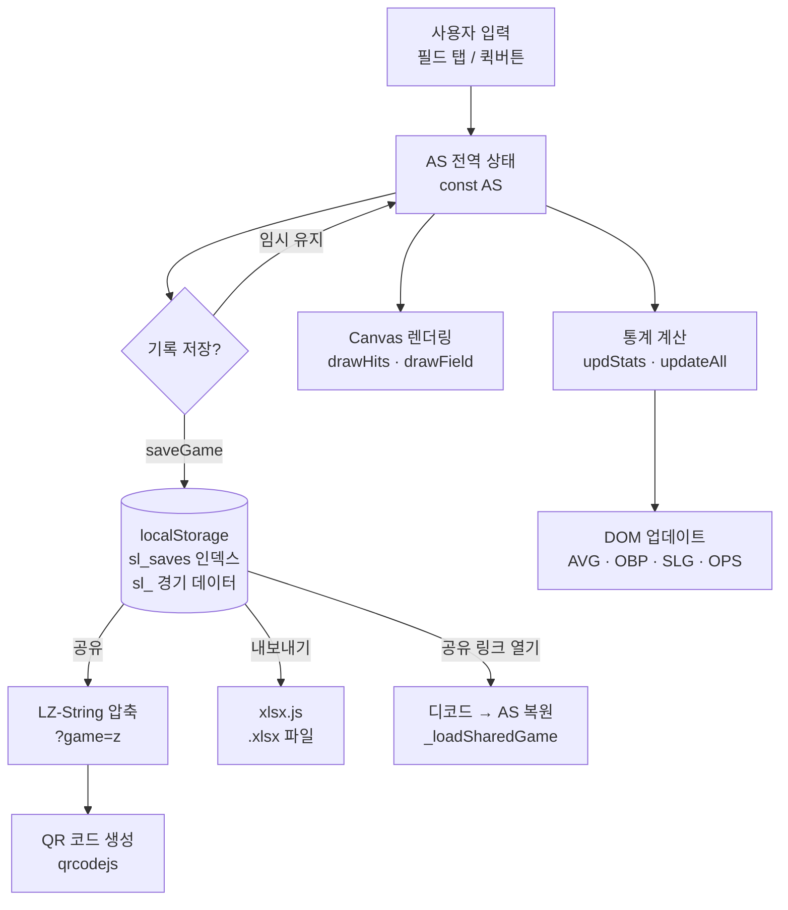
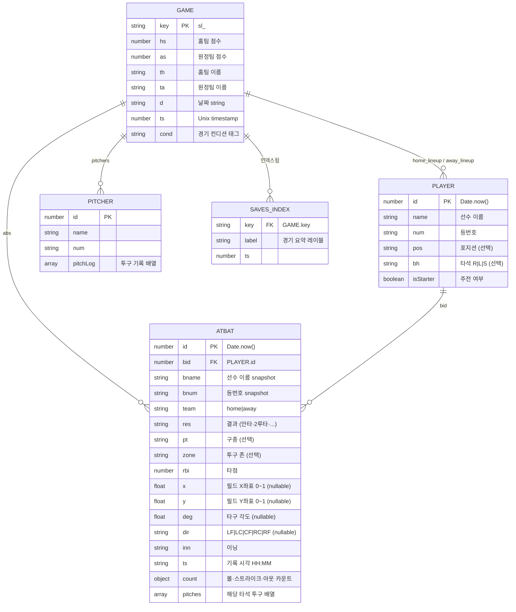

# SprayLab — Your Swing, Visualized

> 야구 타구 기록 · 분석 · 공유를 위한 서버 없는 PWA

[](https://kimjeongcheol13.github.io/baseball-spray-chart/)
[](https://kimjeongcheol13.github.io/baseball-spray-chart/)
[](https://developer.mozilla.org/en-US/docs/Web/HTML)
[](https://developer.mozilla.org/en-US/docs/Web/CSS)
[](https://developer.mozilla.org/en-US/docs/Web/JavaScript)
[](https://web.dev/progressive-web-apps/)

---

## 서비스 소개

**SprayLab**은 야구 경기 현장에서 타구 방향·결과·구종을 실시간으로 기록하고,  
타율·출루율·OPS 같은 세이버메트릭스 지표를 즉시 시각화하는 웹 앱입니다.

- **가입 없음, 서버 없음, 완전 무료** — 브라우저만 있으면 바로 사용
- **오프라인 지원** — 인터넷이 없는 야구장에서도 동작
- **QR / URL 공유** — 팀원과 링크 하나로 경기 데이터 공유

### 주요 기능

| 기능 | 설명 |
|------|------|
| 스프레이 차트 | Canvas 필드를 탭해 타구 착지 위치 기록 |
| 라인업 관리 | 홈·원정팀 선수 등록, 드래그 & 드롭 타순 변경 |
| 타격 통계 자동 계산 | AVG / OBP / SLG / OPS / wOBA / BABIP / BB% / K% |
| 타구 방향 분석 | 당겨치기(Pull) / 센터 / 밀어치기(Oppo) 비율 |
| 9분할 투구 존 | 코스별 피안타·삼진 패턴 추적 |
| 투수 분석 탭 | 구종·코스·결과 기록 → 도넛차트 & 히트맵 자동 생성 |
| 경기 운영 모드 | 타순 자동 전진, 3아웃 시 이닝 자동 전환 |
| 패턴 분석 | 2타석 이상 시 당겨치기 성향·삼진 패턴·강점 코스 감지 |
| 핫존 오버레이 | 안타 / 아웃 / 장타 밀집 구역 히트맵 |
| 성적카드 PNG | 9:16 개인 카드 · 1:1 팀 카드 이미지 저장 |
| Excel 내보내기 | 경기목록 / 통합선수통계 / 전체타석기록 3시트 .xlsx |
| QR & URL 공유 | LZ-String으로 압축한 게임 데이터를 URL 파라미터에 내장 |
| PWA | 홈 화면 추가 가능, Service Worker 오프라인 캐시 |
| KakaoTalk 대응 | 인앱 브라우저 감지 → JSON 수동 복사 & Chrome 이동 안내 |

### 대상 사용자

- 아마추어 야구 / 사회인 야구 팀의 **기록원 · 코치 · 감독**
- 자신의 타격 데이터를 직접 분석하고 싶은 **선수**
- 경기 데이터를 팀원과 공유하고 싶은 **팀 운영자**

---

## 기술 아키텍처

### 전체 데이터 흐름



### 주요 모듈 / 함수 구조

```
index.html (489 KB — 단일 파일)
├── <style id="landing-css">  랜딩 페이지 CSS
├── <style id="app-css">      앱 CSS (다크테마, 반응형)
├── <div id="landing-page">   랜딩/마케팅 페이지 HTML
├── <div id="app-page">       앱 UI HTML
│   ├── .pnl-left             라인업 패널
│   ├── .pnl-center           스프레이 차트 (Canvas)
│   └── .pnl-right            통계 탭 패널 (타석기록/타자/팀통계/차트/투수)
└── <script>
    ├── 카카오 감지            detectKakaoBrowser()
    ├── 전역 상태              const AS = { ... }
    ├── 캔버스 엔진            initCanvas, drawField, drawHits, onFClick
    ├── 선수 관리              addPlayer, delPlayer, selBatter, renderLP
    ├── 타석 기록              recHit, recOther, fabRecord, undoLast
    ├── 통계 계산              updStats, updBatterStat, calcWOBA, calcBABIP
    ├── 차트 렌더              drawDonut, drawTrendChart, drawInningChart
    ├── 투수 분석              addPitcher, recordPitch, renderPitcherStats
    ├── 저장/불러오기          saveGame, loadGame, restoreGame, deleteGame
    ├── 공유 시스템            shareURL, _loadSharedGame, showShareQR
    ├── Excel 내보내기         exportGameToExcel, exportAllGames
    ├── PNG 내보내기           exportSprayPNG, exportShareCard
    ├── 경기 운영 모드         gfToggle, gfNextBatter, gfEndGame
    ├── 패턴 분석              renderAIInsight (rule-based heuristic)
    ├── 인터랙티브 투어        TOUR[], startTour, tourGo
    └── PWA / SW 등록          navigator.serviceWorker.register('sw.js')
```

### Canvas 레이어 구조

세 개의 Canvas가 겹쳐 있습니다:

| Canvas ID | 역할 |
|-----------|------|
| `#fldCanvas` | 야구장 배경 (잔디·흙·파울라인) 정적 렌더 |
| `#hitCanvas` | 타구 점 · 방향 선 동적 렌더 |
| `#ovrCanvas` | 핫존 히트맵 오버레이 (pointer-events: none) |

---

## 데이터 구조 (ERD)



### localStorage 스키마

```
localStorage
├── sl_saves          JSON   저장 경기 인덱스 배열 [{key, label, ts}, ...]
├── sl_<timestamp>    JSON   경기 전체 데이터 (GAME + 중첩 배열)
├── sl_ob3            "1"    온보딩 완료 플래그
├── sl_visited        "1"    첫 방문 플래그
└── sl_teams          JSON   팀 시스템 데이터 (추후 개발 예정)
```

---

## 기술적 의사결정

### 왜 Vanilla JS인가?

React · Vue 같은 프레임워크를 쓰지 않은 이유:

- **배포 복잡도 0** — 빌드 단계가 없어 `index.html` 파일 하나로 GitHub Pages에 즉시 배포 가능
- **오프라인 우선** — 번들러 없이 Service Worker가 파일 하나를 캐시하면 앱 전체가 오프라인에서 동작
- **야구장 인터넷 환경** — 경기장은 LTE가 불안정한 경우가 많아 의존성 CDN 로드 실패를 최소화하는 것이 중요
- **로딩 속도** — 프레임워크 런타임 없이 단 하나의 HTML 파일만 로드

### 왜 localStorage인가?

- **계정 불필요** — 가입 없이 즉시 사용. 마찰 없는 온보딩이 아마추어 야구 사용자에게 중요
- **개인정보 보호** — 모든 경기 데이터가 본인 기기에만 저장됨
- **실시간 오프라인** — 인터넷이 끊겨도 경기 기록과 저장이 정상 동작
- **서버 운영비 0** — 오픈소스 / 개인 프로젝트로 서버 비용 부담 없음

### 왜 단일 index.html인가?

- 파일 하나만 GitHub Pages에 올리면 배포 완료
- PWA Service Worker가 단일 URL만 캐시하면 완전한 오프라인 앱 구현
- 팀원이 파일을 다운로드 받아 로컬에서 `file://`로도 실행 가능 (일부 기능 제한)

### 서버 없는 공유 구현 방법

공유 기능은 LZ-String 라이브러리로 구현됩니다:

```
경기 데이터 (JSON)
    ↓ LZString.compressToEncodedURIComponent()
압축된 문자열 (LZ-String URI-safe Base64)
    ↓ URL 파라미터에 삽입
https://kimjeongcheol13.github.io/baseball-spray-chart/?game=z<encoded>
    ↓ 수신자가 링크 열기
LZString.decompressFromEncodedURIComponent() → JSON 복원 → 배너 표시
```

공유 URL에는 다음이 인코딩됩니다:
- 홈·원정팀 이름 및 점수
- 전체 타석 기록 (좌표, 결과, 구종, 존, 이닝)

QR 코드는 qrcodejs를 사용해 클라이언트에서 바로 생성합니다.

---

## 한계와 개선 로드맵

### 현재 구조의 한계

| 항목 | 내용 |
|------|------|
| **localStorage 용량** | 브라우저당 약 5~10MB. 경기당 약 20~100KB이므로 수십 경기는 문제없으나, 장기간 대용량 사용 시 한계 |
| **디바이스 단독** | 기기 간 동기화 불가. 팀원 A의 기록을 팀원 B가 실시간으로 볼 수 없음 |
| **공유 URL 길이** | 타석이 300개에 가까워지면 LZ-String 압축 후에도 URL이 수 KB에 달해 일부 환경에서 문제 발생 가능 |
| **단일 HTML 유지보수** | 489KB HTML 파일 하나에 CSS·JS·HTML이 전부 존재. 기능 추가 시 파일이 계속 커짐 |
| **오프라인 한계** | 최초 방문 시 인터넷 필요. Service Worker 캐시 이후 오프라인 가능 |

### 실제 서비스 전환 시 설계 방향

#### DB 설계 방향

```sql
-- 주요 엔티티
teams          (id, name, color, created_at)
seasons        (id, team_id, year, label)
games          (id, home_team_id, away_team_id, season_id, played_at, home_score, away_score)
players        (id, team_id, name, number, position, batting_hand)
plate_appearances (id, game_id, player_id, inning, result, rbi,
                   field_x, field_y, direction, pitch_type, zone,
                   balls, strikes, outs, created_at)
pitchers       (id, game_id, name, number)
pitches        (id, pitcher_id, plate_appearance_id, pitch_type, zone, result)
```

#### 백엔드 아키텍처

```
클라이언트 (React / Vue + Canvas)
    ↕ REST API / WebSocket
백엔드 (Node.js / FastAPI)
    ↕
PostgreSQL (경기 데이터)
Redis (실시간 경기 중 상태 캐시)
S3 / GCS (PNG 카드, Excel 파일 임시 저장)
```

실시간 공동 기록(같은 경기를 여러 기기에서)이 필요하다면 WebSocket + Redis Pub/Sub 구조가 적합합니다.

#### 리눅스 서버 배포

```bash
# 예시: Ubuntu + Docker Compose
docker compose up -d   # nginx + app + postgres + redis

# nginx: 정적 파일 서빙 + API 리버스 프록시
# 도메인: Let's Encrypt TLS 자동 갱신
# 백업: 매일 pg_dump → S3
```

---

## 로컬 실행 방법

```bash
# 1. 저장소 클론
git clone https://github.com/kimjeongcheol13/baseball-spray-chart.git
cd baseball-spray-chart

# 2. 브라우저에서 열기 (아래 중 택일)

# 방법 A: 파일 직접 열기 (Service Worker 비활성화, 기본 기능은 정상 동작)
open index.html          # macOS
start index.html         # Windows

# 방법 B: 로컬 서버 (PWA, Service Worker, 공유 URL 포함 전체 기능)
python3 -m http.server 8080
# 브라우저에서 http://localhost:8080 접속
```

> **참고**: Service Worker는 `https://` 또는 `localhost`에서만 등록됩니다.  
> `file://`로 열면 오프라인 캐시와 PWA 설치 기능이 비활성화되지만  
> 타구 기록·통계·저장·공유 등 핵심 기능은 정상 동작합니다.

---

## 프로젝트 구조

```
baseball-spray-chart/
├── index.html      # 앱 전체 (HTML + CSS + JS, 489 KB)
├── sw.js           # Service Worker (오프라인 캐시, spraylab-v6)
├── manifest.json   # PWA 매니페스트
└── icon.svg        # 앱 아이콘
```

---

## 외부 라이브러리

| 라이브러리 | 버전 | 용도 |
|-----------|------|------|
| [LZ-String](https://github.com/pieroxy/lz-string) | 1.5.0 | 게임 데이터 URL 압축 (공유 기능) |
| [xlsx.js](https://github.com/SheetJS/sheetjs) | 0.18.5 | 클라이언트 Excel 내보내기 |
| [qrcodejs](https://github.com/davidshimjs/qrcodejs) | 1.0.0 | QR 코드 생성 |
| [Noto Sans KR](https://fonts.google.com/noto/specimen/Noto+Sans+KR) | — | 한국어 UI 폰트 |
| [JetBrains Mono](https://www.jetbrains.com/lp/mono/) | — | 통계 수치 모노스페이스 폰트 |
| [Bebas Neue](https://fonts.google.com/specimen/Bebas+Neue) | — | 디스플레이 헤딩 폰트 |

---

*만든이: [kimjeongcheol13](https://github.com/kimjeongcheol13)*
