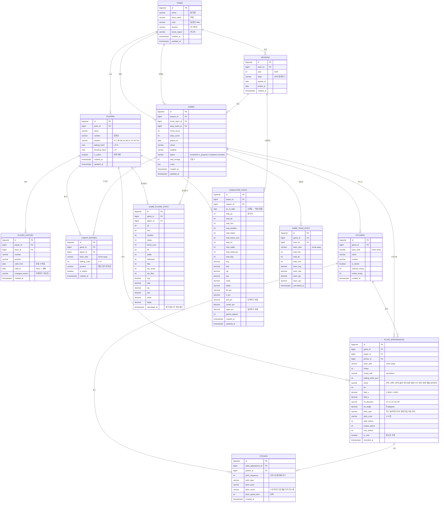

# SprayLab — 데이터베이스 설계 문서

> **버전**: 1.0 · **작성일**: 2026-05-23  
> 현재 SprayLab은 `localStorage` 기반 단일 파일 PWA입니다.  
> 이 문서는 **서버 기반으로 확장할 때의 완전한 관계형 DB 설계**를 정의합니다.

---

## 목차

1. [설계 철학](#1-설계-철학)
2. [시간 데이터 처리 패턴](#2-시간-데이터-처리-패턴)
3. [전체 ERD](#3-전체-erd)
4. [테이블 정의 (DDL)](#4-테이블-정의-ddl)
5. [인덱스 전략](#5-인덱스-전략)
6. [핵심 쿼리 예시](#6-핵심-쿼리-예시)
7. [localStorage → PostgreSQL 마이그레이션](#7-localstorage--postgresql-마이그레이션)
8. [확장 고려사항](#8-확장-고려사항)

---

## 1. 설계 철학

### 원칙 3가지

| 원칙 | 내용 |
|------|------|
| **원본 불변** | 타석 기록(`plate_appearances`)은 절대 삭제·수정하지 않음. 수정이 필요하면 `is_void = true`로 무효 처리 |
| **이력 추적** | 모든 변경 가능한 데이터는 언제 바뀌었는지 추적 가능해야 함 |
| **통계 분리** | 원본 데이터(타석)와 집계 데이터(통계)를 테이블 분리. 통계는 경기 종료 후 재계산·갱신 |

### 데이터 성격에 따른 분류

```
원본 (Source of Truth)          집계 (Derived / Snapshot)
──────────────────────          ──────────────────────────
plate_appearances                game_player_stats
pitches                          cumulative_stats
games                            game_team_stats
players                          
lineup_entries
```

---

## 2. 시간 데이터 처리 패턴

이 설계에는 3가지 시간 패턴이 함께 사용됩니다.

### 패턴 A — Audit 컬럼 (모든 테이블 공통)

`created_at`, `updated_at`을 모든 테이블에 추가.  
**언제 만들어지고 마지막으로 언제 바뀌었는지** 기록.

```sql
created_at  TIMESTAMPTZ DEFAULT NOW()   -- 생성 시각, 불변
updated_at  TIMESTAMPTZ DEFAULT NOW()   -- 수정할 때마다 갱신
```

```
변경 전                변경 후
───────────────────    ───────────────────
row 1 | ... | 수정전  →  row 1 | ... | 수정후
             created_at 2025-03-01      created_at 2025-03-01  (불변)
             updated_at 2025-03-01      updated_at 2025-05-20  (갱신)
```

---

### 패턴 B — SCD Type 2 (선수 이력)

선수의 등번호·포지션·소속팀이 바뀌어도 **과거 기록을 보존**해야 합니다.  
행을 덮어쓰지 않고, `valid_from`/`valid_to`를 이용해 유효 기간을 관리합니다.

```
시간 흐름 →

player_history 테이블:
┌─────┬───────┬────────┬────────────┬────────────┐
│ id  │ 등번호 │ 포지션  │ valid_from │  valid_to  │
├─────┼───────┼────────┼────────────┼────────────┤
│  1  │  17   │  2B    │ 2023-03-01 │ 2024-06-15 │  ← 과거 (만료)
│  2  │  17   │  SS    │ 2024-06-15 │ 2025-01-10 │  ← 과거 (만료)
│  3  │  23   │  SS    │ 2025-01-10 │    NULL    │  ← 현재 (valid_to=NULL)
└─────┴───────┴────────┴────────────┴────────────┘
```

**조회 패턴**:
```sql
-- 현재 정보
WHERE player_id = ? AND valid_to IS NULL

-- 특정 날짜 기준 정보 (예: 2024년 9월 1일)
WHERE player_id = ?
  AND valid_from <= '2024-09-01'
  AND (valid_to > '2024-09-01' OR valid_to IS NULL)
```

---

### 패턴 C — 날짜별 스냅샷 (누적 통계)

경기가 끝날 때마다 누적 통계를 계산하고 `as_of_date`와 함께 행으로 저장.  
"5월 1일 기준 타율"과 "5월 20일 기준 타율"이 모두 남습니다.

```
cumulative_stats 테이블:
┌───────────┬───────────┬────────────┬──────┬──────┬──────┐
│ player_id │ season_id │ as_of_date │ avg  │ obp  │ ops  │
├───────────┼───────────┼────────────┼──────┼──────┼──────┤
│     7     │     3     │ 2025-04-05 │ .250 │ .310 │ .720 │  ← 4월 5일 경기 후
│     7     │     3     │ 2025-04-12 │ .300 │ .360 │ .820 │  ← 4월 12일 경기 후
│     7     │     3     │ 2025-05-03 │ .285 │ .345 │ .780 │  ← 5월 3일 경기 후
│     7     │     3     │ 2025-05-20 │ .310 │ .380 │ .850 │  ← 오늘 (최신)
└───────────┴───────────┴────────────┴──────┴──────┴──────┘
```

---

## 3. 전체 ERD



---

## 4. 테이블 정의 (DDL)

### 기본 설정

```sql
-- 확장 기능
CREATE EXTENSION IF NOT EXISTS "uuid-ossp";

-- updated_at 자동 갱신 트리거 함수 (모든 테이블 공용)
CREATE OR REPLACE FUNCTION set_updated_at()
RETURNS TRIGGER AS $$
BEGIN
  NEW.updated_at = NOW();
  RETURN NEW;
END;
$$ LANGUAGE plpgsql;
```

---

### teams

```sql
CREATE TABLE teams (
  id            BIGSERIAL     PRIMARY KEY,
  name          VARCHAR(50)   NOT NULL,
  short_name    VARCHAR(10),
  color         VARCHAR(7),                       -- '#4b8cf5'
  division      VARCHAR(30),
  home_region   VARCHAR(50),
  created_at    TIMESTAMPTZ   NOT NULL DEFAULT NOW(),
  updated_at    TIMESTAMPTZ   NOT NULL DEFAULT NOW()
);

CREATE TRIGGER trg_teams_updated_at
  BEFORE UPDATE ON teams
  FOR EACH ROW EXECUTE FUNCTION set_updated_at();
```

---

### seasons

```sql
CREATE TABLE seasons (
  id            BIGSERIAL     PRIMARY KEY,
  team_id       BIGINT        NOT NULL REFERENCES teams(id) ON DELETE CASCADE,
  year          INT           NOT NULL CHECK (year BETWEEN 2000 AND 2100),
  label         VARCHAR(60),                      -- '2025 춘계리그'
  started_at    DATE,
  ended_at      DATE,
  created_at    TIMESTAMPTZ   NOT NULL DEFAULT NOW(),
  CONSTRAINT chk_season_dates CHECK (started_at IS NULL OR ended_at IS NULL OR started_at <= ended_at)
);
```

---

### players

```sql
CREATE TABLE players (
  id            BIGSERIAL     PRIMARY KEY,
  team_id       BIGINT        NOT NULL REFERENCES teams(id) ON DELETE CASCADE,
  name          VARCHAR(50)   NOT NULL,
  number        VARCHAR(5),
  position      VARCHAR(5),                       -- P C 1B 2B SS 3B LF CF RF DH
  batting_hand  CHAR(1)       CHECK (batting_hand IN ('L','R','S')),
  throwing_hand CHAR(1)       CHECK (throwing_hand IN ('L','R')),
  is_active     BOOLEAN       NOT NULL DEFAULT TRUE,
  created_at    TIMESTAMPTZ   NOT NULL DEFAULT NOW(),
  updated_at    TIMESTAMPTZ   NOT NULL DEFAULT NOW()
);

CREATE TRIGGER trg_players_updated_at
  BEFORE UPDATE ON players
  FOR EACH ROW EXECUTE FUNCTION set_updated_at();
```

---

### player_history — SCD Type 2

```sql
CREATE TABLE player_history (
  id             BIGSERIAL    PRIMARY KEY,
  player_id      BIGINT       NOT NULL REFERENCES players(id) ON DELETE CASCADE,
  team_id        BIGINT       REFERENCES teams(id),
  number         VARCHAR(5),
  position       VARCHAR(5),
  valid_from     DATE         NOT NULL,
  valid_to       DATE,                            -- NULL = 현재 유효
  changed_reason VARCHAR(100),                   -- '트레이드', '부상 복귀', '번호 변경'
  created_at     TIMESTAMPTZ  NOT NULL DEFAULT NOW(),
  CONSTRAINT chk_ph_dates CHECK (valid_to IS NULL OR valid_from < valid_to)
);

-- 한 선수의 현재 이력은 반드시 1개만
CREATE UNIQUE INDEX uq_player_history_current
  ON player_history(player_id)
  WHERE valid_to IS NULL;
```

---

### games

```sql
CREATE TABLE games (
  id              BIGSERIAL    PRIMARY KEY,
  season_id       BIGINT       REFERENCES seasons(id),
  home_team_id    BIGINT       NOT NULL REFERENCES teams(id),
  away_team_id    BIGINT       NOT NULL REFERENCES teams(id),
  home_score      INT          NOT NULL DEFAULT 0 CHECK (home_score >= 0),
  away_score      INT          NOT NULL DEFAULT 0 CHECK (away_score >= 0),
  played_at       DATE         NOT NULL,
  venue           VARCHAR(100),
  weather         VARCHAR(50),
  status          VARCHAR(20)  NOT NULL DEFAULT 'scheduled'
                               CHECK (status IN ('scheduled','in_progress','completed','cancelled')),
  total_innings   INT          NOT NULL DEFAULT 9,
  notes           TEXT,
  created_at      TIMESTAMPTZ  NOT NULL DEFAULT NOW(),
  updated_at      TIMESTAMPTZ  NOT NULL DEFAULT NOW(),
  CONSTRAINT chk_different_teams CHECK (home_team_id <> away_team_id)
);

CREATE TRIGGER trg_games_updated_at
  BEFORE UPDATE ON games
  FOR EACH ROW EXECUTE FUNCTION set_updated_at();
```

---

### lineup_entries

```sql
CREATE TABLE lineup_entries (
  id              BIGSERIAL    PRIMARY KEY,
  game_id         BIGINT       NOT NULL REFERENCES games(id) ON DELETE CASCADE,
  player_id       BIGINT       NOT NULL REFERENCES players(id),
  team_side       VARCHAR(5)   NOT NULL CHECK (team_side IN ('home','away')),
  batting_order   INT          CHECK (batting_order BETWEEN 1 AND 9),
  position        VARCHAR(5),
  is_starter      BOOLEAN      NOT NULL DEFAULT TRUE,
  created_at      TIMESTAMPTZ  NOT NULL DEFAULT NOW(),
  UNIQUE (game_id, team_side, batting_order)    -- 같은 경기 같은 팀에서 타순 중복 불가
);
```

---

### pitchers

```sql
CREATE TABLE pitchers (
  id              BIGSERIAL    PRIMARY KEY,
  game_id         BIGINT       NOT NULL REFERENCES games(id) ON DELETE CASCADE,
  team_side       VARCHAR(5)   NOT NULL CHECK (team_side IN ('home','away')),
  name            VARCHAR(50)  NOT NULL,
  number          VARCHAR(5),
  is_starter      BOOLEAN      NOT NULL DEFAULT TRUE,
  entered_inning  INT          NOT NULL DEFAULT 1,
  exited_inning   INT,
  created_at      TIMESTAMPTZ  NOT NULL DEFAULT NOW()
);
```

---

### plate_appearances — 핵심 원본 테이블

```sql
CREATE TABLE plate_appearances (
  id                  BIGSERIAL    PRIMARY KEY,
  game_id             BIGINT       NOT NULL REFERENCES games(id) ON DELETE CASCADE,
  player_id           BIGINT       NOT NULL REFERENCES players(id),
  pitcher_id          BIGINT       REFERENCES pitchers(id),
  team_side           VARCHAR(5)   NOT NULL CHECK (team_side IN ('home','away')),
  inning              INT          NOT NULL CHECK (inning >= 1),
  inning_half         VARCHAR(6)   NOT NULL CHECK (inning_half IN ('top','bottom')),
  batting_order_pos   INT          CHECK (batting_order_pos BETWEEN 1 AND 9),
  result              VARCHAR(20)  NOT NULL CHECK (result IN (
                        '안타','내야안타','2루타','3루타','홈런',
                        '아웃','삼진','볼넷','사구',
                        '희타','희비','병살')),
  rbi                 INT          NOT NULL DEFAULT 0 CHECK (rbi >= 0),
  field_x             DECIMAL(6,4) CHECK (field_x BETWEEN 0 AND 1),
  field_y             DECIMAL(6,4) CHECK (field_y BETWEEN 0 AND 1),
  hit_direction       VARCHAR(5)   CHECK (hit_direction IN ('LF','LC','CF','RC','RF')),
  hit_angle           DECIMAL(6,2),
  pitch_type          VARCHAR(20)  CHECK (pitch_type IN (
                        '직구','슬라이더','커브','체인지업','투심','커터','포크','너클','기타')),
  pitch_zone          CHAR(1)      CHECK (pitch_zone IN ('1','2','3','4','5','6','7','8','9')),
  balls_before        INT          NOT NULL DEFAULT 0 CHECK (balls_before BETWEEN 0 AND 3),
  strikes_before      INT          NOT NULL DEFAULT 0 CHECK (strikes_before BETWEEN 0 AND 2),
  outs_before         INT          NOT NULL DEFAULT 0 CHECK (outs_before BETWEEN 0 AND 2),
  is_void             BOOLEAN      NOT NULL DEFAULT FALSE,  -- 취소/오기록
  void_reason         VARCHAR(100),
  recorded_at         TIMESTAMPTZ  NOT NULL DEFAULT NOW()
);
```

---

### pitches

```sql
CREATE TABLE pitches (
  id                    BIGSERIAL    PRIMARY KEY,
  plate_appearance_id   BIGINT       NOT NULL REFERENCES plate_appearances(id) ON DELETE CASCADE,
  pitcher_id            BIGINT       NOT NULL REFERENCES pitchers(id),
  pitch_sequence        INT          NOT NULL CHECK (pitch_sequence >= 1),
  pitch_type            VARCHAR(20),
  pitch_zone            CHAR(1)      CHECK (pitch_zone IN ('1','2','3','4','5','6','7','8','9')),
  pitch_result          VARCHAR(15)  CHECK (pitch_result IN
                          ('스트라이크','볼','파울','헛스윙','타격','번트파울')),
  pitch_speed_kmh       INT          CHECK (pitch_speed_kmh BETWEEN 50 AND 200),
  created_at            TIMESTAMPTZ  NOT NULL DEFAULT NOW(),
  UNIQUE (plate_appearance_id, pitch_sequence)
);
```

---

### game_player_stats — 경기별 통계 스냅샷

```sql
CREATE TABLE game_player_stats (
  id              BIGSERIAL    PRIMARY KEY,
  game_id         BIGINT       NOT NULL REFERENCES games(id) ON DELETE CASCADE,
  player_id       BIGINT       NOT NULL REFERENCES players(id),
  ab              INT          NOT NULL DEFAULT 0,
  hits            INT          NOT NULL DEFAULT 0,
  doubles         INT          NOT NULL DEFAULT 0,
  triples         INT          NOT NULL DEFAULT 0,
  home_runs       INT          NOT NULL DEFAULT 0,
  rbi             INT          NOT NULL DEFAULT 0,
  walks           INT          NOT NULL DEFAULT 0,
  strikeouts      INT          NOT NULL DEFAULT 0,
  hbp             INT          NOT NULL DEFAULT 0,
  sac_bunts       INT          NOT NULL DEFAULT 0,
  sac_flies       INT          NOT NULL DEFAULT 0,
  avg             DECIMAL(4,3),
  obp             DECIMAL(4,3),
  slg             DECIMAL(4,3),
  ops             DECIMAL(4,3),
  woba            DECIMAL(4,3),
  babip           DECIMAL(4,3),
  calculated_at   TIMESTAMPTZ  NOT NULL DEFAULT NOW(),
  UNIQUE (game_id, player_id)
);
```

---

### cumulative_stats — 날짜별 누적 통계 스냅샷 ← 시간 데이터의 핵심

```sql
CREATE TABLE cumulative_stats (
  id              BIGSERIAL    PRIMARY KEY,
  player_id       BIGINT       NOT NULL REFERENCES players(id) ON DELETE CASCADE,
  season_id       BIGINT       NOT NULL REFERENCES seasons(id),
  as_of_date      DATE         NOT NULL,          -- ← 이 날짜 기준 누적
  -- 원시 누적 수치
  total_pa        INT          NOT NULL DEFAULT 0,
  total_ab        INT          NOT NULL DEFAULT 0,
  total_hits      INT          NOT NULL DEFAULT 0,
  total_doubles   INT          NOT NULL DEFAULT 0,
  total_triples   INT          NOT NULL DEFAULT 0,
  total_home_runs INT          NOT NULL DEFAULT 0,
  total_rbi       INT          NOT NULL DEFAULT 0,
  total_walks     INT          NOT NULL DEFAULT 0,
  total_strikeouts INT         NOT NULL DEFAULT 0,
  total_hbp       INT          NOT NULL DEFAULT 0,
  -- 계산 지표
  avg             DECIMAL(4,3),                   -- 타율
  obp             DECIMAL(4,3),                   -- 출루율
  slg             DECIMAL(4,3),                   -- 장타율
  ops             DECIMAL(4,3),                   -- OPS
  woba            DECIMAL(4,3),                   -- 가중출루율
  babip           DECIMAL(4,3),                   -- 인플레이타율
  bb_pct          DECIMAL(4,3),                   -- 볼넷 비율
  k_pct           DECIMAL(4,3),                   -- 삼진 비율
  -- 타구 방향
  pull_pct        DECIMAL(4,3),                   -- 당겨치기 비율
  center_pct      DECIMAL(4,3),
  oppo_pct        DECIMAL(4,3),                   -- 밀어치기 비율
  games_played    INT          NOT NULL DEFAULT 0,
  -- 감사 컬럼
  created_at      TIMESTAMPTZ  NOT NULL DEFAULT NOW(),
  updated_at      TIMESTAMPTZ  NOT NULL DEFAULT NOW(),
  UNIQUE (player_id, season_id, as_of_date)       -- 날짜별 중복 방지
);

CREATE TRIGGER trg_cumulative_stats_updated_at
  BEFORE UPDATE ON cumulative_stats
  FOR EACH ROW EXECUTE FUNCTION set_updated_at();
```

---

### game_team_stats

```sql
CREATE TABLE game_team_stats (
  id              BIGSERIAL    PRIMARY KEY,
  game_id         BIGINT       NOT NULL REFERENCES games(id) ON DELETE CASCADE,
  team_id         BIGINT       NOT NULL REFERENCES teams(id),
  team_side       VARCHAR(5)   NOT NULL CHECK (team_side IN ('home','away')),
  total_hits      INT          NOT NULL DEFAULT 0,
  total_ab        INT          NOT NULL DEFAULT 0,
  total_runs      INT          NOT NULL DEFAULT 0,
  team_avg        DECIMAL(4,3),
  team_obp        DECIMAL(4,3),
  team_slg        DECIMAL(4,3),
  team_ops        DECIMAL(4,3),
  calculated_at   TIMESTAMPTZ  NOT NULL DEFAULT NOW(),
  UNIQUE (game_id, team_id)
);
```

---

## 5. 인덱스 전략

```sql
-- ── plate_appearances ──────────────────────────────────────────
-- 경기별 전체 타석 조회 (가장 빈번)
CREATE INDEX idx_pa_game_id
  ON plate_appearances(game_id)
  WHERE is_void = FALSE;

-- 선수별 타석 조회
CREATE INDEX idx_pa_player_id
  ON plate_appearances(player_id)
  WHERE is_void = FALSE;

-- 결과별 필터 (안타만, 삼진만 등)
CREATE INDEX idx_pa_result
  ON plate_appearances(result)
  WHERE is_void = FALSE;

-- 타구 방향 분석 (field_x, field_y NULL 제외)
CREATE INDEX idx_pa_hit_coords
  ON plate_appearances(player_id, hit_direction)
  WHERE field_x IS NOT NULL AND is_void = FALSE;

-- ── cumulative_stats ───────────────────────────────────────────
-- 선수+시즌 누적 통계 조회
CREATE INDEX idx_cs_player_season
  ON cumulative_stats(player_id, season_id);

-- 최신 스냅샷 조회 (as_of_date 내림차순)
CREATE INDEX idx_cs_latest
  ON cumulative_stats(player_id, season_id, as_of_date DESC);

-- ── player_history (SCD Type 2) ────────────────────────────────
-- 현재 유효한 이력만 조회
CREATE INDEX idx_ph_current
  ON player_history(player_id)
  WHERE valid_to IS NULL;

-- 날짜 범위 조회
CREATE INDEX idx_ph_date_range
  ON player_history(player_id, valid_from, valid_to);

-- ── games ──────────────────────────────────────────────────────
-- 날짜 내림차순 (최근 경기 목록)
CREATE INDEX idx_games_played_at
  ON games(played_at DESC);

-- 팀별 경기 목록
CREATE INDEX idx_games_home_team  ON games(home_team_id, played_at DESC);
CREATE INDEX idx_games_away_team  ON games(away_team_id, played_at DESC);

-- ── pitches ────────────────────────────────────────────────────
CREATE INDEX idx_pitches_pa_id
  ON pitches(plate_appearance_id);

CREATE INDEX idx_pitches_pitcher
  ON pitches(pitcher_id);
```

---

## 6. 핵심 쿼리 예시

### Q1. 특정 선수의 시즌 최신 누적 통계

```sql
SELECT
  p.name,
  p.number,
  cs.as_of_date,
  cs.total_pa,
  cs.total_ab,
  cs.total_hits,
  cs.avg,
  cs.obp,
  cs.slg,
  cs.ops,
  cs.woba,
  cs.games_played
FROM cumulative_stats cs
JOIN players p ON p.id = cs.player_id
WHERE cs.player_id  = :player_id
  AND cs.season_id  = :season_id
ORDER BY cs.as_of_date DESC
LIMIT 1;
```

---

### Q2. 선수의 타율 변화 추이 (날짜별 스냅샷 활용)

```sql
SELECT
  as_of_date,
  avg,
  obp,
  ops,
  total_ab,
  games_played
FROM cumulative_stats
WHERE player_id = :player_id
  AND season_id = :season_id
ORDER BY as_of_date ASC;
-- → 이 결과를 꺾은선 차트로 시각화
```

---

### Q3. 경기 종료 후 누적 통계 갱신 (Upsert)

```sql
-- 경기 종료 시 호출되는 프로시저
INSERT INTO cumulative_stats (
  player_id, season_id, as_of_date,
  total_pa, total_ab, total_hits,
  total_doubles, total_triples, total_home_runs,
  total_rbi, total_walks, total_strikeouts, total_hbp,
  avg, obp, slg, ops, woba, babip,
  bb_pct, k_pct,
  pull_pct, center_pct, oppo_pct,
  games_played
)
SELECT
  pa.player_id,
  :season_id,
  CURRENT_DATE,                                        -- as_of_date = 오늘
  COUNT(*)                                             AS total_pa,
  COUNT(*) FILTER (WHERE pa.result NOT IN ('볼넷','사구','희타','희비'))
                                                       AS total_ab,
  COUNT(*) FILTER (WHERE pa.result IN ('안타','내야안타','2루타','3루타','홈런'))
                                                       AS total_hits,
  COUNT(*) FILTER (WHERE pa.result = '2루타')          AS total_doubles,
  COUNT(*) FILTER (WHERE pa.result = '3루타')          AS total_triples,
  COUNT(*) FILTER (WHERE pa.result = '홈런')           AS total_home_runs,
  SUM(pa.rbi)                                          AS total_rbi,
  COUNT(*) FILTER (WHERE pa.result = '볼넷')           AS total_walks,
  COUNT(*) FILTER (WHERE pa.result = '삼진')           AS total_strikeouts,
  COUNT(*) FILTER (WHERE pa.result = '사구')           AS total_hbp,
  -- 타율
  ROUND(
    COUNT(*) FILTER (WHERE pa.result IN ('안타','내야안타','2루타','3루타','홈런'))::DECIMAL
    / NULLIF(COUNT(*) FILTER (WHERE pa.result NOT IN ('볼넷','사구','희타','희비')), 0)
  , 3),
  -- (OBP, SLG, OPS, wOBA, BABIP 는 생략 - 위와 동일 패턴)
  NULL, NULL, NULL, NULL, NULL,
  NULL, NULL,
  ROUND(COUNT(*) FILTER (WHERE pa.hit_direction IN ('LF','LC'))::DECIMAL / NULLIF(COUNT(*) FILTER (WHERE pa.hit_direction IS NOT NULL), 0), 3),
  ROUND(COUNT(*) FILTER (WHERE pa.hit_direction = 'CF')::DECIMAL         / NULLIF(COUNT(*) FILTER (WHERE pa.hit_direction IS NOT NULL), 0), 3),
  ROUND(COUNT(*) FILTER (WHERE pa.hit_direction IN ('RC','RF'))::DECIMAL  / NULLIF(COUNT(*) FILTER (WHERE pa.hit_direction IS NOT NULL), 0), 3),
  COUNT(DISTINCT pa.game_id)
FROM plate_appearances pa
JOIN games g ON g.id = pa.game_id
WHERE pa.player_id   = :player_id
  AND g.season_id    = :season_id
  AND pa.is_void     = FALSE
GROUP BY pa.player_id
ON CONFLICT (player_id, season_id, as_of_date)
DO UPDATE SET
  total_pa         = EXCLUDED.total_pa,
  total_ab         = EXCLUDED.total_ab,
  total_hits       = EXCLUDED.total_hits,
  avg              = EXCLUDED.avg,
  -- ... 나머지 컬럼
  updated_at       = NOW();
```

---

### Q4. 특정 날짜 기준 선수 정보 조회 (SCD Type 2)

```sql
-- "2024년 9월 1일에 이 선수의 등번호와 포지션은?"
SELECT
  p.name,
  ph.number,
  ph.position,
  ph.team_id,
  ph.valid_from,
  ph.valid_to
FROM players p
JOIN player_history ph ON ph.player_id = p.id
WHERE p.id              = :player_id
  AND ph.valid_from    <= '2024-09-01'
  AND (ph.valid_to     >  '2024-09-01' OR ph.valid_to IS NULL);
```

---

### Q5. 팀 전체 타율 순위 (시즌 기준)

```sql
SELECT
  p.name,
  p.number,
  cs.avg,
  cs.obp,
  cs.ops,
  cs.total_ab,
  cs.total_hits,
  cs.games_played,
  RANK() OVER (ORDER BY cs.avg DESC) AS avg_rank
FROM cumulative_stats cs
JOIN players p ON p.id = cs.player_id
WHERE cs.season_id = :season_id
  AND cs.as_of_date = (
    -- 각 선수의 가장 최근 스냅샷
    SELECT MAX(as_of_date)
    FROM cumulative_stats
    WHERE player_id = cs.player_id
      AND season_id = cs.season_id
  )
  AND cs.total_ab >= 10   -- 최소 타수 기준
ORDER BY cs.avg DESC;
```

---

### Q6. 구종별 피안타 패턴 (투수 분석)

```sql
SELECT
  pt.pitch_type,
  COUNT(*)                                                          AS total_faced,
  COUNT(*) FILTER (WHERE pa.result IN ('안타','내야안타','2루타','3루타','홈런'))
                                                                    AS hits_allowed,
  ROUND(
    COUNT(*) FILTER (WHERE pa.result IN ('안타','내야안타','2루타','3루타','홈런'))::DECIMAL
    / NULLIF(COUNT(*) FILTER (WHERE pa.result NOT IN ('볼넷','사구','희타','희비')), 0)
  , 3)                                                              AS avg_against,
  COUNT(*) FILTER (WHERE pa.result = '삼진')                        AS strikeouts,
  COUNT(*) FILTER (WHERE pa.result = '볼넷')                        AS walks
FROM plate_appearances pa
JOIN pitchers pt ON pt.id = pa.pitcher_id
WHERE pa.game_id = :game_id
  AND pa.is_void = FALSE
GROUP BY pt.pitch_type
ORDER BY total_faced DESC;
```

---

## 7. localStorage → PostgreSQL 마이그레이션

현재 SprayLab의 localStorage 데이터를 PostgreSQL로 옮기는 순서:

```
현재 구조 (localStorage)
──────────────────────────
sl_saves  →  [{key, label, ts}, ...]     경기 인덱스
sl_<key>  →  {th, ta, hs, as,            경기 데이터
              home_lineup: [...],
              away_lineup: [...],
              abs: [...],                 타석 배열
              pitchers: [...]}
```

### Step 1 — 데이터 추출 (브라우저 콘솔)

```javascript
// 브라우저 개발자 도구 콘솔에서 실행
const saves = JSON.parse(localStorage.getItem('sl_saves') || '[]');
const allGames = saves.map(s => ({
  meta: s,
  data: JSON.parse(localStorage.getItem(s.key))
}));
console.log(JSON.stringify(allGames));
// → 복사해서 migration_data.json으로 저장
```

### Step 2 — 변환 매핑

| localStorage 필드 | PostgreSQL 테이블.컬럼 |
|-------------------|----------------------|
| `th` | `teams.name` (홈팀) |
| `ta` | `teams.name` (원정팀) |
| `hs`, `as` | `games.home_score`, `away_score` |
| `ts` | `games.played_at` |
| `home_lineup[].name` | `players.name` |
| `home_lineup[].num` | `players.number` |
| `abs[].res` | `plate_appearances.result` |
| `abs[].x`, `.y` | `plate_appearances.field_x`, `field_y` |
| `abs[].pt` | `plate_appearances.pitch_type` |
| `abs[].zone` | `plate_appearances.pitch_zone` |
| `abs[].rbi` | `plate_appearances.rbi` |
| `abs[].inn` | `plate_appearances.inning` |

### Step 3 — 마이그레이션 스크립트 (Node.js 개요)

```javascript
// migrate.js
const data = require('./migration_data.json');

for (const game of data) {
  // 1. 팀 upsert
  const homeTeam = await upsertTeam(game.data.th);
  const awayTeam = await upsertTeam(game.data.ta);

  // 2. 경기 생성
  const gameRow = await insertGame({
    home_team_id: homeTeam.id,
    away_team_id: awayTeam.id,
    home_score:   game.data.hs,
    away_score:   game.data.as,
    played_at:    new Date(game.meta.ts)
  });

  // 3. 선수 upsert
  for (const p of game.data.home_lineup) {
    await upsertPlayer({ team_id: homeTeam.id, name: p.name, number: p.num });
  }

  // 4. 타석 기록 삽입
  for (const ab of game.data.abs) {
    await insertPlateAppearance({
      game_id:    gameRow.id,
      player_id:  await findPlayer(ab.bid, ab.bname),
      result:     ab.res,
      field_x:    ab.x,
      field_y:    ab.y,
      pitch_type: ab.pt,
      pitch_zone: ab.zone,
      rbi:        ab.rbi || 0
    });
  }

  // 5. 통계 재계산
  await recalculateStats(gameRow.id);
}
```

---

## 8. 확장 고려사항

### RLS (Row Level Security) — Supabase 사용 시

```sql
-- 팀 코드로 본인 팀 데이터만 접근
ALTER TABLE games ENABLE ROW LEVEL SECURITY;

CREATE POLICY "팀 멤버만 경기 조회"
  ON games FOR SELECT
  USING (
    home_team_id IN (SELECT team_id FROM team_members WHERE user_id = auth.uid())
    OR
    away_team_id IN (SELECT team_id FROM team_members WHERE user_id = auth.uid())
  );
```

### 실시간 공동 기록 (WebSocket 확장)

```
기록원 A (태블릿)                기록원 B (스마트폰)
      │  plate_appearance INSERT      │
      └──────────────────────────────▶│
                                      │ Supabase Realtime
      ◀─────────────────────────────── broadcast
      │  화면 즉시 동기화              │
```

### 인덱스 파티셔닝 (대용량)

타석 기록이 수십만 건 이상으로 늘어나면 `plate_appearances`를 연도별로 파티셔닝:

```sql
CREATE TABLE plate_appearances (
  ...
  recorded_at TIMESTAMPTZ NOT NULL DEFAULT NOW()
) PARTITION BY RANGE (recorded_at);

CREATE TABLE plate_appearances_2024 PARTITION OF plate_appearances
  FOR VALUES FROM ('2024-01-01') TO ('2025-01-01');

CREATE TABLE plate_appearances_2025 PARTITION OF plate_appearances
  FOR VALUES FROM ('2025-01-01') TO ('2026-01-01');
```

---

*설계: SprayLab 프로젝트 · 최종 수정: 2026-05-23*
